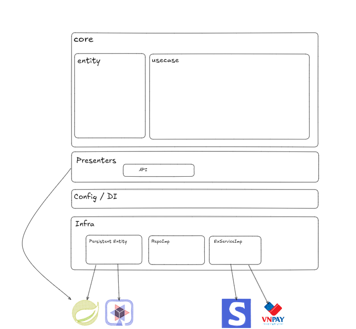

# Clean Architecture E-commerce

A demonstration of Clean Architecture principles for an e-commerce order creation flow implemented using both Spring Boot and Quarkus.

## Architecture Diagram

You can view the interactive system architecture diagram on Excalidraw:
- [Excalidraw Design Board](https://excalidraw.com/#room=841903d72cb7df450978,sHmyuT7OKyg9kX--M6rvbw)



---

## Project Structure

The project separates concerns by dividing code into layers:
- **Core Package (`com.example.ecommerce.core`)**: Pure Java domain models, entities, and use cases. Has zero dependencies on any frameworks or external libraries (other than Lombok).
- **Configuration & Presenters**: Infrastructure layers hosting Spring Boot and Quarkus framework configurations, REST controllers, repositories, and payment integrations.

---

## Unit Testing & Verification

The core business logic is covered by JUnit 5 and Mockito tests to ensure correct execution independent of any framework. 

### Running Tests
To run the tests and generate a code coverage report using JaCoCo:
```bash
./mvnw clean test jacoco:report
```

### Checking Coverage
The coverage report is generated in the target directory:
- **HTML UI (open in browser):**
  ```bash
  xdg-open target/site/jacoco/index.html
  ```
- **CSV Summary:**
  ```bash
  target/site/jacoco/jacoco.csv
  ```

---
## License
This project is licensed under the MIT License - see the [LICENSE](LICENSE) file for details.
